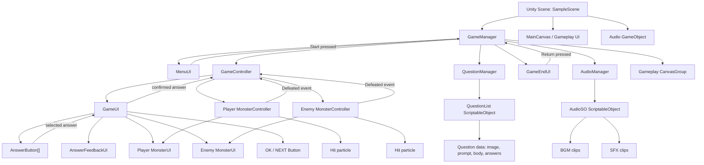
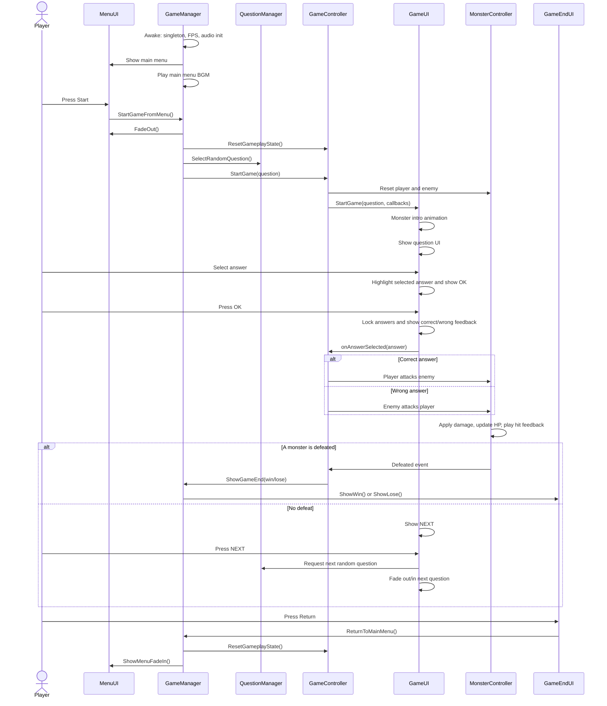
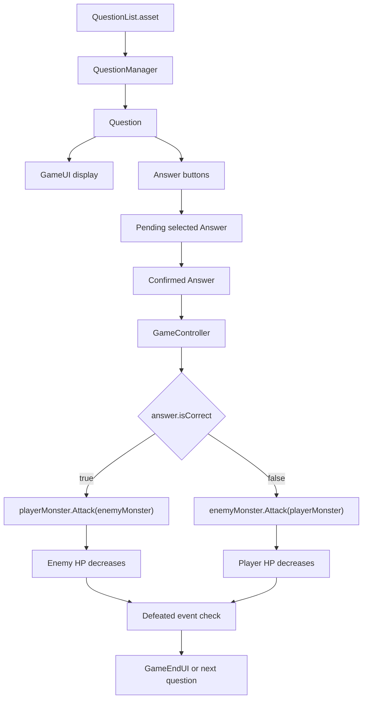

# MonGame Project Flow

Last analyzed: 2026-06-08

## Project Snapshot

MonGame is a Unity 2022.3.57f1 2D educational quiz-battle game. The player starts from a main menu, enters a monster battle, answers multiple-choice questions, and each confirmed answer causes either the player monster or enemy monster to attack. The match ends when one monster reaches 0 HP, then the player can return to the menu and start again.

Primary runtime scene:

- `Assets/Scenes/SampleScene.unity`

Primary scripts:

- `Assets/Scripts/GameManager.cs`
- `Assets/Scripts/GameController.cs`
- `Assets/Scripts/GameUI.cs`
- `Assets/Scripts/QuestionManager.cs`
- `Assets/Scripts/QuestionList.cs`
- `Assets/Scripts/MonsterController.cs`
- `Assets/Scripts/MonsterUI.cs`
- `Assets/Scripts/MenuUI.cs`
- `Assets/Scripts/GameEndUI.cs`
- `Assets/Scripts/AudioManager.cs`

## Architecture Flow

## Runtime Sequence

## UI/UX Flow

```mermaid
flowchart LR
    Launch["Launch Game"] --> MainMenu["Main Menu"]
    MainMenu --> StartCTA["Start Button"]
    StartCTA --> MenuFade["Menu fades out"]
    MenuFade --> GameplayFade["Gameplay fades in"]
    GameplayFade --> MonsterIntro["Player and enemy monsters enter"]
    MonsterIntro --> QuestionPanel["Question panel appears"]

    QuestionPanel --> ReadPrompt["Read image / prompt / answer body"]
    ReadPrompt --> PickAnswer["Tap an answer"]
    PickAnswer --> SelectionState["Selected answer turns yellow"]
    SelectionState --> ChangeChoice{"Change choice?"}
    ChangeChoice -- "Yes" --> PickAnswer
    ChangeChoice -- "No" --> ConfirmOK["Press OK"]

    ConfirmOK --> LockedState["Answers lock"]
    LockedState --> RevealResult["Selected answer shows green/red; correct answer may be revealed"]
    RevealResult --> FeedbackPopup["Correct/Wrong feedback popup"]
    FeedbackPopup --> AttackResult{"Answer correct?"}

    AttackResult -- "Correct" --> PlayerAttack["Player monster attacks enemy"]
    AttackResult -- "Wrong" --> EnemyAttack["Enemy monster attacks player"]

    PlayerAttack --> DamageFeedback["HP bar changes, hit blink, hit VFX/SFX"]
    EnemyAttack --> DamageFeedback
    DamageFeedback --> DefeatCheck{"Any HP <= 0?"}

    DefeatCheck -- "No" --> NextCTA["NEXT button"]
    NextCTA --> QuestionTransition["Question fades out/in"]
    QuestionTransition --> QuestionPanel

    DefeatCheck -- "Enemy defeated" --> WinScreen["Win screen"]
    DefeatCheck -- "Player defeated" --> LoseScreen["Lose screen"]
    WinScreen --> ReturnCTA["Return button"]
    LoseScreen --> ReturnCTA
    ReturnCTA --> EndFade["End screen fades out"]
    EndFade --> MainMenu
```

## Screen Inventory

| Screen or state | Main objects | Player action | System response |
| --- | --- | --- | --- |
| Main menu | `MenuUI`, start button | Press Start | Plays click SFX, fades menu, starts game |
| Gameplay intro | `GameManager`, `GameUI`, `MonsterUI` | None | Fades gameplay, resets monsters, animates monster intro |
| Question | `GameUI`, `AnswerButton[]`, question image/text/body | Select answer | Stores pending answer, highlights selected button, shows OK |
| Confirmed answer | `GameUI`, `AnswerFeedbackUI` | Press OK | Locks answers, reveals result, plays correct/wrong feedback |
| Combat result | `GameController`, `MonsterController`, `MonsterUI` | None | Correct answer attacks enemy; wrong answer attacks player |
| Next question | `GameUI`, `QuestionManager` | Press NEXT | Randomly selects next question, avoiding immediate repeat when possible |
| End state | `GameEndUI` | Press Return | Shows win/lose, then resets gameplay and returns to menu |

## Data Flow

## Component Responsibilities

- `GameManager`: top-level coordinator, singleton, game state gate, screen transitions, audio facade.
- `MenuUI`: start button interaction and menu fade behavior.
- `GameController`: gameplay rules coordinator, routes answer results to monster attacks, listens for defeat.
- `GameUI`: question rendering, answer selection/confirmation, feedback timing, question transitions.
- `QuestionManager`: selects random questions from a `QuestionList`, optionally avoiding immediate repeats.
- `QuestionList`: ScriptableObject content model for questions and answers.
- `AnswerButton`: individual answer display, selection callback, selected/correct/wrong visual state.
- `AnswerFeedbackUI`: temporary correct/wrong popup with SFX and tweened visibility.
- `MonsterController`: monster HP/damage/attack logic and defeated event.
- `MonsterUI`: monster name/HP rendering, intro/idle/attack/hit animation.
- `GameEndUI`: win/lose result presentation and return-to-menu action.
- `AudioManager`: BGM/SFX lookup and playback using `AudioSO`.
- `AudioSO`: ScriptableObject registry for enum-based BGM and SFX clips.
- `PlayerController`, `MobileButton`, `CameraFollow`: movement-oriented support scripts, currently separate from the quiz-battle core loop.
- `UIParticleEffect`: helper for attaching particle systems to UI targets.

## UX Notes

- The answer confirmation model is forgiving: a selected answer is only pending until OK is pressed, so players can change their mind.
- The OK/NEXT button uses one physical UI control with two modes. This keeps the question panel compact but makes button state clarity important.
- Correct/wrong feedback appears before damage resolution, then attack animation and HP feedback communicate the consequence.
- The game currently loops random questions indefinitely until a monster is defeated. There is no visible progress meter or question count.
- Win/lose is HP-based, not score-based. This is simple and readable for a learning game, especially with visible HP bars.

## Suggested UI/UX Improvements

- Add a tiny turn/result timeline near the question panel: `Select -> OK -> Feedback -> Attack -> NEXT`.
- Add a disabled OK state or microcopy state before answer selection if players miss that OK appears only after selection.
- Add visible question difficulty/category labels if the question set grows.
- Add a short hit number or damage badge on attack, because HP bar movement can be subtle.
- Consider switching BGM to gameplay music in `StartGame()` if the intended experience differs between menu and battle.
- If player movement is still part of the design, connect `PlayerController` to a visible exploration state; otherwise isolate it as prototype-only code.
